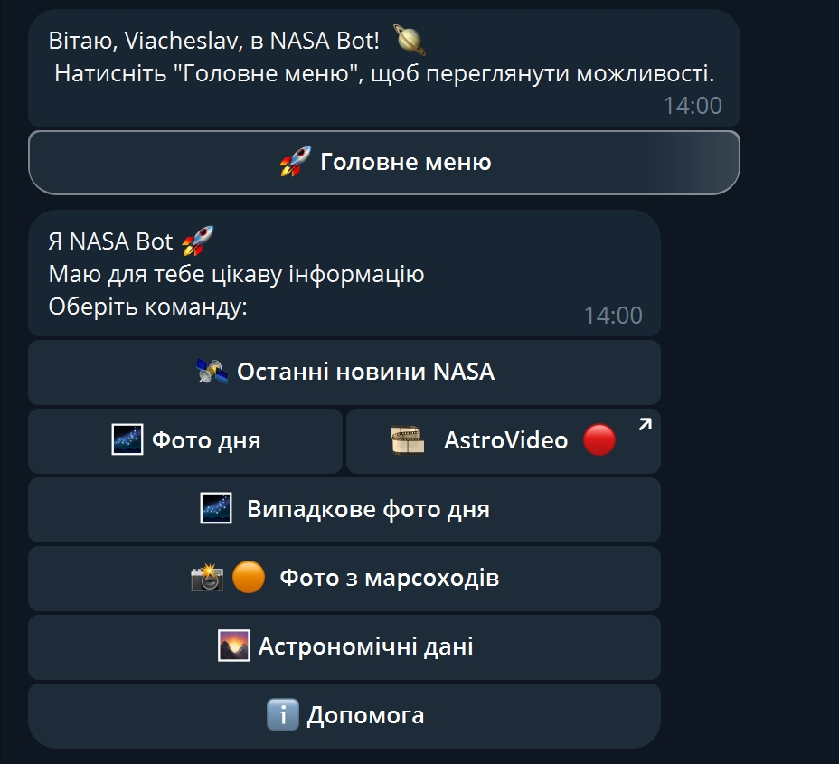
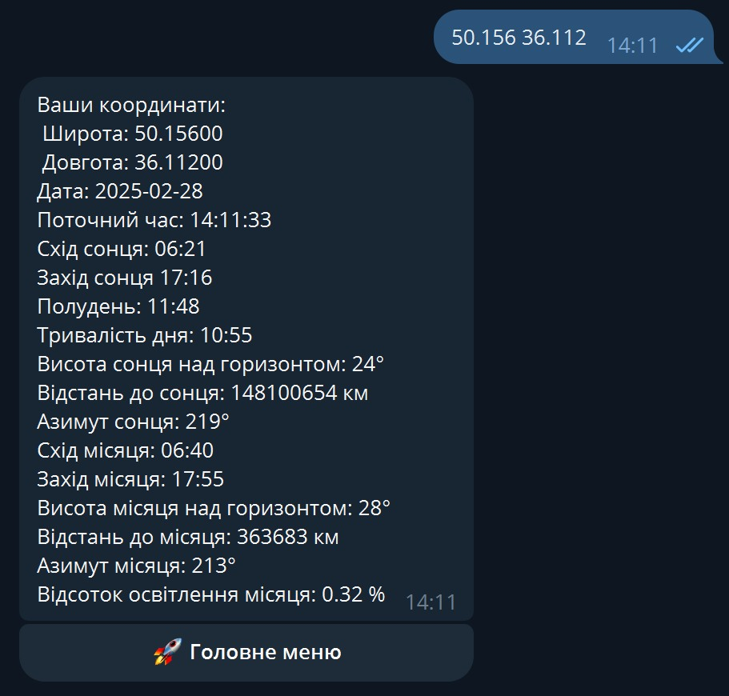

# NASA Bot

NASA Bot – це Telegram бот, який інтегрує дані з кількох API для надання актуальної інформації про космос. Бот отримує дані з офіційного сайту NASA, використовує DeepL API для перекладу, а також API від IPGeolocation для астрономічної інформації.

## Функціональні можливості

## Головне меню

Головне меню забезпечує інтуїтивний доступ до всіх функцій бота.  

- **Останні новини NASA**  
  Отримання актуальних новин через RSS стрічку з посиланнями на повні статті.

- **Фото дня з описом**  
  Відображення фотографії дня з детальним описом, наданим NASA.

- **Фото дня за випадковий день**  
  Можливість переглянути фото для випадково обраного дня.

- **Фото з марсоходів**  
  Перегляд зображень з марсоходів NASA.  
  Користувач може обрати дату та камеру марсоходу для перегляду відповідних фотографій.  
  
  

- **Астрономічні дані**  
  Отримання інформації про:
    - Схід і захід сонця та місяця
    - Час для заданого місця
    - Тривалість дня
    - Азимути сонця та місяця
    - Висоту над горизонтом
    - Відсоток освітлення місяця  
      Дані запитуються через [IPGeolocation Astronomy API](https://ipgeolocation.io/documentation.html) за координатами користувача або його IP на вибір.  
      

## Особливості
- Для доступу до цих API потрібні API ключі, які можна отримати на ресурсах цих API.
  - [NASA API Documentation](https://api.nasa.gov/)
  - [DeepL API Documentation](https://developers.deepl.com/docs)
  - [IPGeolocation Astronomy API Documentation](https://ipgeolocation.io/documentation.html)
